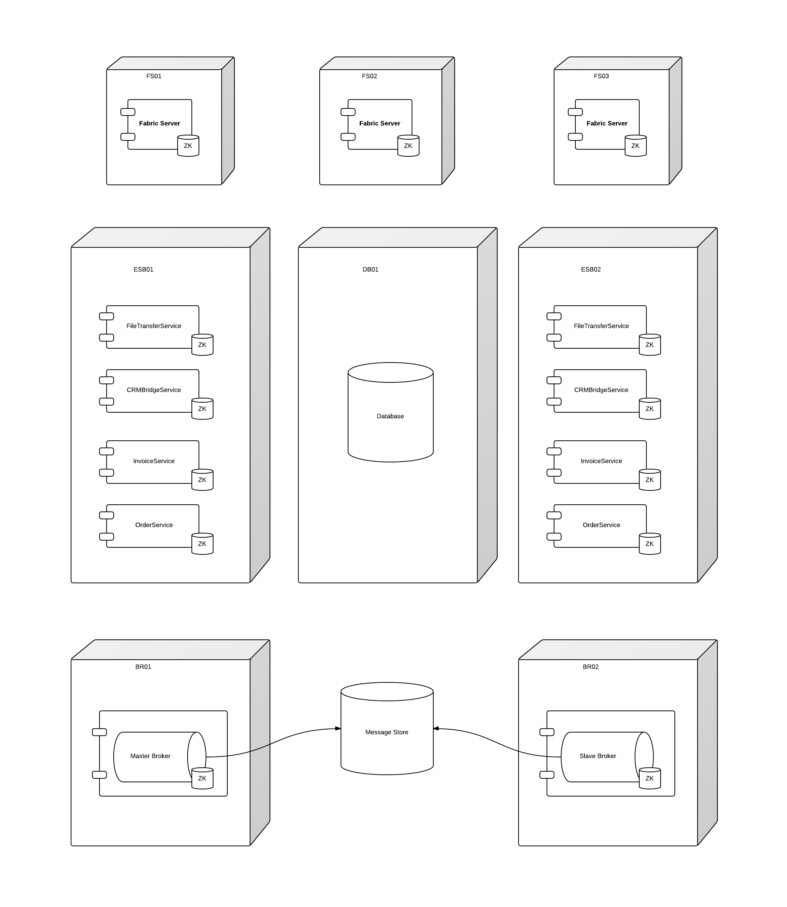

### Example HA deployment architecture 

This is an example of a highly available messaging solution using fabric8.  The diagram demonstrates using three nodes (fs01, fs02, fs03) to create a three member ensemble to ensure high availability of the [registry](http://fabric8.io/gitbook/registry.html#registry).

We can also see that to ensure HA of our broker we have a shared message store and [master / slave](http://fabric8.io/gitbook/brokerTopology.html#a-master-slave-broker) setup on br01 and br02.  Other options to look at if you don't have an NFSv4 for the message store and better performence than a DB can offer would be to look at the share nothing [replicated broker](http://fabric8.io/gitbook/brokerTopology.html#b-replicated-broker) option.

There are also two nodes esb01 and esb02 which have the same profile applied to ensure high availability of our processing containers which include example Order, Invoice and other custom components.

